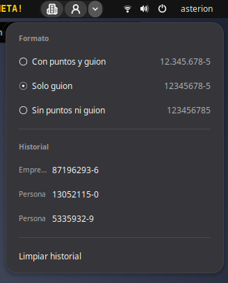
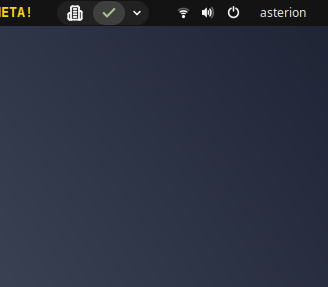
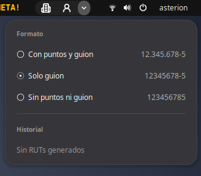

# RUT Generator

A GNOME Shell extension for developers and testers: one click on the top panel
copies a random, valid Chilean RUT to the clipboard, ready to paste into the
form you are testing. Choose a company or a person, pick the format, and copy
recent RUTs again from the history.



## How it works

The extension adds a small capsule to the top panel with three buttons:

| Button | What it does |
|---|---|
| Building | Generates and copies a **company** RUT, between 50.000.000 and 99.999.999. |
| Person | Generates and copies a **person** RUT, between 1.000.000 and 16.999.999. |
| Arrow | Opens the menu with the format and the history. |

Once the RUT is copied, the button shows a green check mark for a moment:



### Format

Pick how RUTs are copied. Your choice is remembered.

| Option | Example |
|---|---|
| With dots and dash (default) | `12.345.678-5` |
| Dash only | `12345678-5` |
| No dots or dash | `123456785` |

### History

The menu keeps the last 8 RUTs you generated, newest first, always shown in the
current format. Click one to copy it again, or clear the list. The history is
kept until you log out.



Every RUT has a correct check digit (modulo 11, including `K`). They are random
test data: one of them may happen to belong to a real company or person, so do
not use them to identify anyone.

The extension only writes to the clipboard; it never reads it. It speaks
**English, Spanish and French**, following your system language.

## Installation

Requires GNOME Shell 50, `git`, `make` and `gettext`.

```bash
git clone https://github.com/asterion/rut-generator.git \
    ~/.local/share/gnome-shell/extensions/rut-generator@asterion
make -C ~/.local/share/gnome-shell/extensions/rut-generator@asterion
```

`make` compiles the settings schema and the translations.
Log out and back in, then enable it:

```bash
gnome-extensions enable rut-generator@asterion
```

## Settings

The history size can be changed from 3 to 20 (default 8):

```bash
gsettings --schemadir ~/.local/share/gnome-shell/extensions/rut-generator@asterion/schemas \
    set org.gnome.shell.extensions.rut-generator history-limit 12
```

## Uninstalling

```bash
gnome-extensions disable rut-generator@asterion
rm -rf ~/.local/share/gnome-shell/extensions/rut-generator@asterion
```

## Credits

Icons from [Lucide](https://lucide.dev) (ISC license), see
[icons/LICENSE-lucide.txt](icons/LICENSE-lucide.txt).

## License

[GPL-2.0-or-later](LICENSE)
