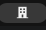

# RUT Empresa

A GNOME Shell extension for developers and testers: one click on the top panel
copies a random, valid Chilean company RUT to the clipboard, ready to paste
into the form you are testing.

## How it works

| | Top panel |
|---|---|
| The button |  |
| Hover |  |
| Clicked: RUT copied |  |

- Click the building icon and a new RUT such as `91584187-2` is in your clipboard.
- The icon turns into a check mark for a second to confirm the copy.
- Every RUT is in the range used by companies (50.000.000 to 99.999.999) and
  has a correct check digit, including `K`.
- The format is the number, a dash and the check digit, without dots.

The RUTs are random test data. One of them may happen to belong to a real
company, so do not use them to identify anyone.

The extension only writes to the clipboard; it never reads it.

## Installation

Requires GNOME Shell 50.

```bash
git clone https://github.com/asterion/rut-empresa.git \
    ~/.local/share/gnome-shell/extensions/rut-empresa@asterion
```

Log out and back in, then enable it:

```bash
gnome-extensions enable rut-empresa@asterion
```

## Uninstalling

```bash
gnome-extensions disable rut-empresa@asterion
rm -rf ~/.local/share/gnome-shell/extensions/rut-empresa@asterion
```

## License

[GPL-2.0-or-later](LICENSE)
